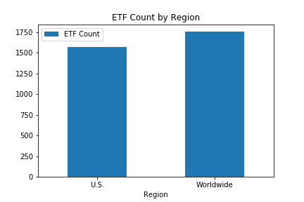
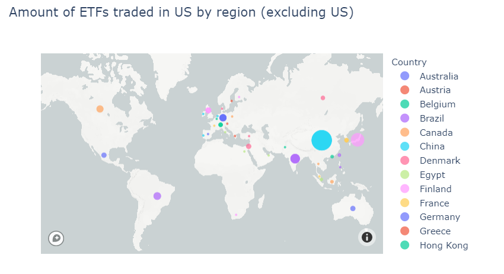
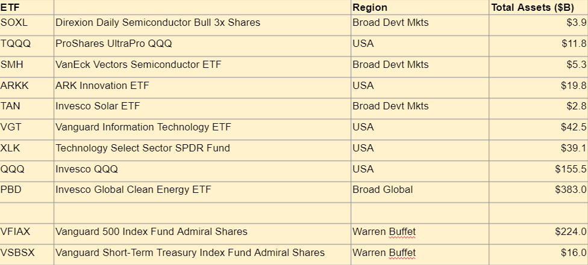
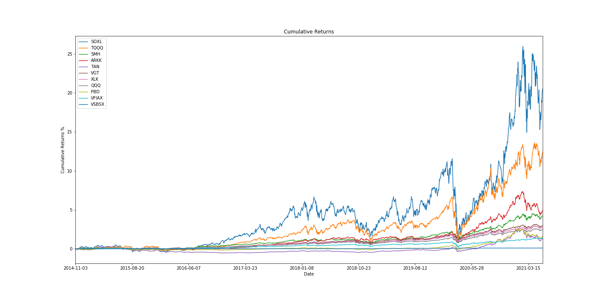
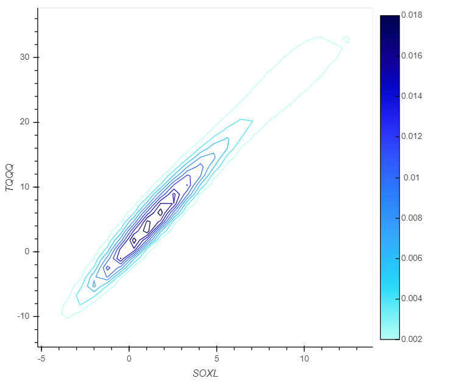
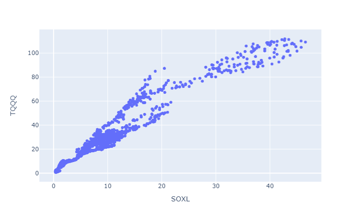
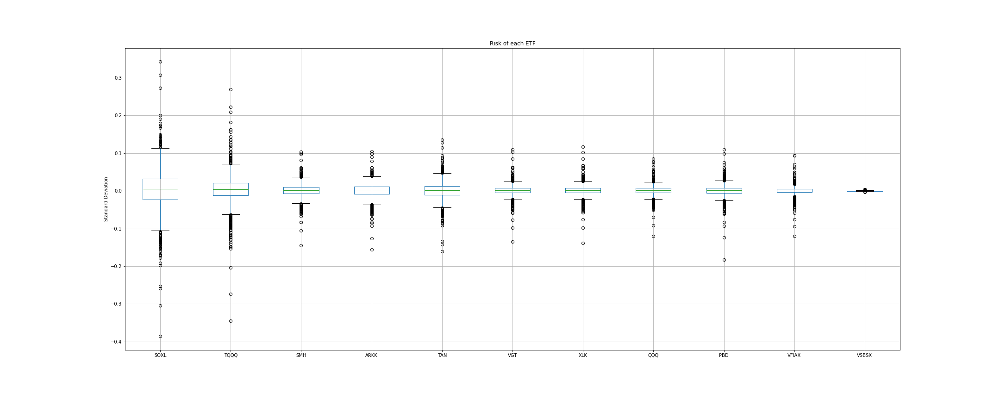
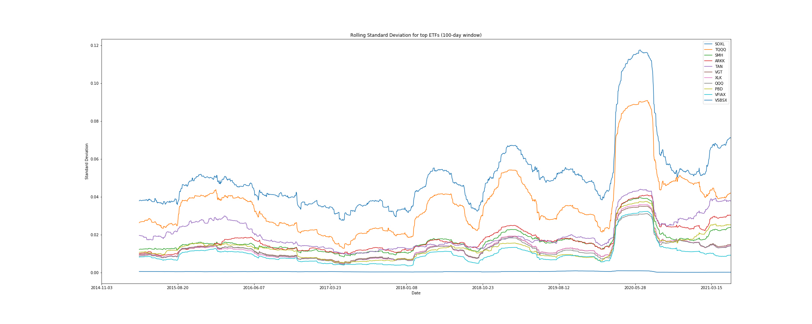
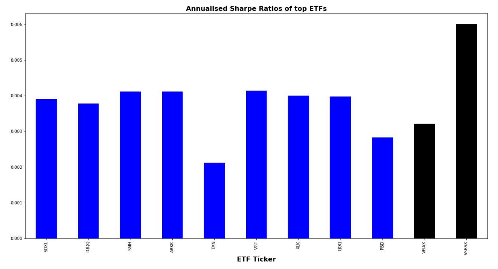
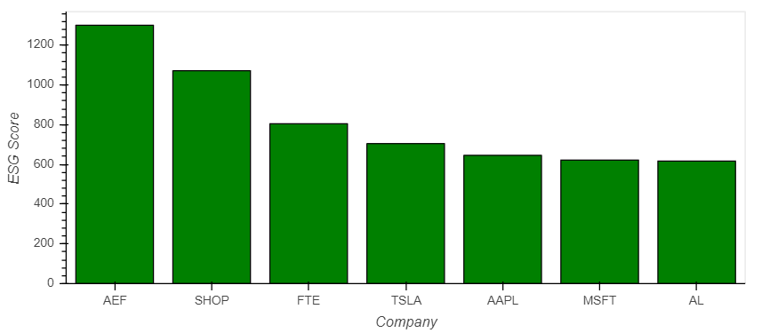

# Project1_Fintech_SydUni
## Team: MGM - Mike Rae, Grace Ho, Michael Yip

# Project Name: "OLD LADY BUFFETT"

# Core hypothesis
## That Warren Buffet's suggested ETFs were not the best choice for Mrs Buffet's eventual inheritance.
In 2013, Warren Buffett stated that he advised trustees to manage the money he will leave to his wife by allocating
10% in short-term government bonds and 90% in a very low-cost S&P 500 index fund (suggesting Vanguard’s.)
Warren said he believed the long-term results from this policy will be superior to those attained by most investors.
We want to test Warren's suggestion against other options to determine if it is the best recommendation for Mrs Buffet.

# Key Questions to answer:
## What are the appropriate asset classes for Mrs Buffet's inheritance?
We considered asset classes including: direct shares / bonds / FX holdings, cryptocurrencies, real estate, collectables.  
But these were discounted based on our subjective criteria, and we concluded ETFs are an appropriate asset class for Mrs Buffet due to her lack of financial knowledge and life stage.

## How do we select the specific assets within the appropriate asset(s) class?
Within the ETF universe, we used a funnel to output the top performing ETFs over different timeframes.  Then the list was further filtered into a best of the best ETF list.

## What other factors do we need to consider for our final recommendation to Mrs Buffet?  
We also considered ESC (Environmental, Social, and (Corporate) Governance) ratings, risk & volatilty vs return, and time horizon based on Mrs Buffet's age.

## Data Sources used:
 - ETFdb.com for listings of ETFs from around the world which are traded in the USA.
 - yFinance for daily ETF close prices over the past decade.
 - RapidAPI for ESG data points

## Data exploration & clean up process:
### Refer to Project1_ticker_data.ipynb file:

Daily close price data for 561 ETFs over a decade was obtained.  They had to be broken up into 30 smaller data requests and pulled into Jupyter Lab.  

### Refer to Close_price_analysis.ipynb file:

The cumulative returns were reviewed based on 4 time horizons: 1, 3, 5 and 10 year returns.  The top 20 ETFs for each of these time horizons were extracted, resulting in 51 ETFs.
The top 20 ETFs from each timeframe were given a score based on their rank, and an overall ranking obtained over the 4 time horizons.
From this process, a list of top 9 ETFs across all timeframes were selected.
The data was then amended so the top 9 ETFs were reviewed using a consistent start date (7.5 years history), so they could be consistently compared based on cumulative returns, standard deviation, sharpe ratio.

## Our analysis included consideration of:
 - The global distribution of ETFs.
    
    
    
 
 - What are the top performing ETF's.
     
     
 
 - The daily returns distribution, and cumulative returns.
     
     

 - Correlations in the top 2 ETF's.
    
    
    
    
 - Risk of the tops ETF's.
    
    
    
    
 - Review of the Sharpe Ratio's for the ETFs.
 
    
 
 - Which companies are most green (*note partial data).
    
    

## Summary of Findings (refer to above for visualisations and data analysis):

 - SOXL and TQQQ had the best returns however they are 3x leveraged, and high risk & volatile.
 - The Vanguard fund VSBSX has the highest Sharpe Ratio and lowest standard deviation (and overall risk) although very low returns.
 - MGM Consulting’s recommendation for Mrs Buffett would be the 3rd and 4th ranked ETF’s (SMH and ARKK) with good average returns and a good std dev and Sharpe Ratio.

